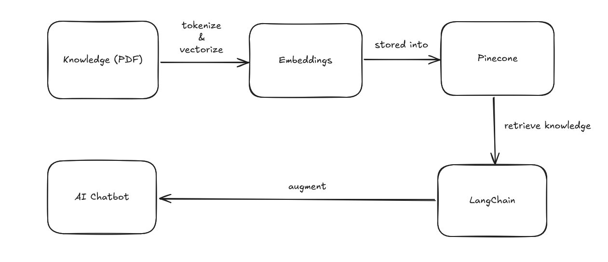
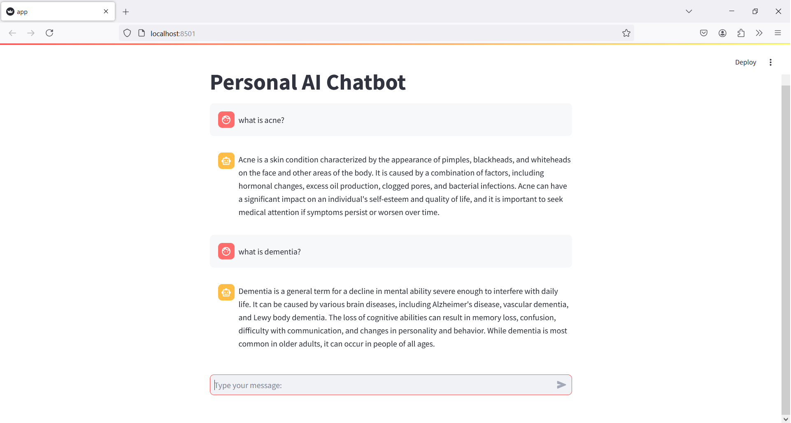

# Introduction
This project implements an AI chatbot that leverages Pinecone indexing for knowledge retrieval. The chatbot uses Langchain for retrievel system between chatbot and Pinecone and Hugging Face embeddings for text processing. PDF data extraction, text chunk creation, and prompt generation are key components of the system.

# Project Structure
- `app.py`: Contains the main script for the personal AI chatbot using Streamlit.
- `store_index.py`: Handles the extraction of data from PDF files, text chunk creation, and upserting embeddings to a Pinecone index.
- `prompt.py`: Defines a template for generating prompts to answer user questions.
- `utils.py`: Contains utility functions for PDF data extraction, text splitting, and downloading Hugging Face embeddings.

# Flowchart

# Files Description
- `app.py`: Implements the chatbot interface using Streamlit, Pinecone for knowledge retrieval, and Langchain for language model operations.
- `store_index.py`: Extracts data from PDF files, splits text into chunks, and upserts embeddings to a Pinecone index.
- `prompt.py`: Defines a template for generating prompts based on context and questions.
- `utils.py`: Contains utility functions for PDF data extraction, text splitting, and Hugging Face embeddings download.

# Setup Instructions
1. Install the required packages by running `pip install -r requirements.txt`.
2. Set up environment variables required for Pinecone API key and host information.
3. Run `python store_index.py` to extract data from PDFs and upsert embeddings to the Pinecone index.
4. Execute `streamlit run app.py` to launch the AI chatbot interface.

# Example Output

# Dependencies
- ctransformers 0.2.5
- sentence-transformers 3.2.1
- pinecone-client 4.1.2
- langchain 0.2.17
- langchain-pinecone 0.1.2
- langchain-community s0.2.18
- langchain-huggingface 0.0.3
- streamlit 1.39.0
- pypdf 4.3.1
- python-dotenv 1.0.1

# Acknowledgements
- This project utilizes Pinecone for efficient vector indexing and retrieval.
- Langchain is used for language model operations and text processing.
- Hugging Face embeddings enhance the chatbot's text understanding capabilities.
